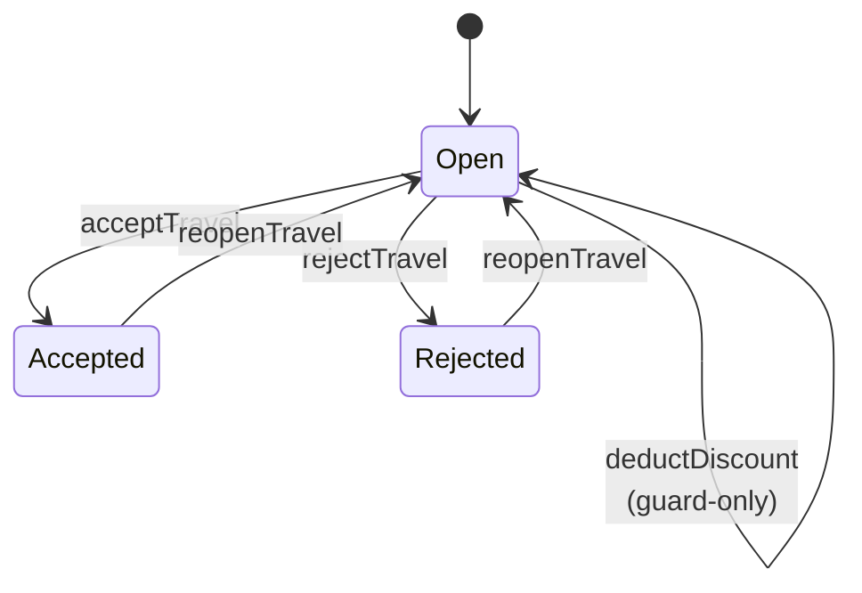

# Exercise 4 - Status Flows

In this exercise, you will learn how the `@flow.status` annotation turns a plain status field into a **state machine**. CAP then enforces which actions are legal in which state, updates the status automatically, and can even generate the corresponding Fiori UI — all from a single CDS declaration.

## Prerequisites

Make sure you have completed [Exercise 3 - Declarative Constraints](03_Declarative_Constraints.md).

## What is `@flow.status`?

`@flow.status` sits on an entity and points at the field that holds its current state (typically an association to a code-list, or an enum). Each of the entity's actions then declares:

- **`@from: [ … ]`** — which states are legal starting points. If the current status isn't in this list, the framework rejects the call with `409 Conflict` and `code: INVALID_FLOW_TRANSITION_SINGLE` / `_MULTI` — no handler code needed.
- **`@to: <state>`** — which state the action transitions **to**. On successful execution, the framework runs an `UPDATE` on the status field for you.

An action can have **`@from` without `@to`** (a guard-only rule — the action runs its usual logic but is blocked outside allowed states) or **`@to` without `@from`** (an unconditional transition).

### Advantages over hand-written guards

- **Declarative**: the state machine is visible in a few lines of CDS, not scattered across `before` handlers.
- **Consistent errors**: the framework produces the same 409 response shape whether the call is via OData, REST, or a bound Fiori action.
- **Automatic UI wiring**: `@flow.status` also generates the `@UI.LineItem` / `@UI.Identification` entries for each action (visible in the Fiori app's Object Page), and hides them appropriately in draft mode.
- **Optional history**: pair the entity with a `$flow.previous` annotation and every state change is auditable — the framework maintains it for you (out of scope for this exercise, but see the [documentation](https://cap.cloud.sap/docs/guides/services/status-flows#to-flow-previous) for details).

## Step 1 — Explore the flow in the code

Open the two files that together define the Travels state machine:

- **[xstravels/srv/travel-flows.cds](../xstravels/srv/travel-flows.cds)** — the flow annotation itself.
- **[xstravels/db/schema.cds](../xstravels/db/schema.cds)** — the `TravelStatus` code-list with the five possible codes.

### The state machine



### The `@flow.status` block

```cds
annotate TravelService.Travels with @flow.status: Status actions {
  deductDiscount  @from: [ #Open ];                                 // guard only
  acceptTravel    @from: [ #Open ]                @to: #Accepted;
  rejectTravel    @from: [ #Open ]                @to: #Rejected;
  reopenTravel    @from: [ #Rejected, #Accepted ] @to: #Open;
}
```

- Each entry names an existing action (declared in [travel-service.cds](../xstravels/srv/travel-service.cds)) and adds `@from` / `@to` metadata to it.
- The `#Open`, `#Accepted`, … references target the enum members of `TravelStatus.code` (see [db/schema.cds](../xstravels/db/schema.cds)) — no string duplication, no typos.

## Step 2 — Walk the state machine

Start the app if you haven't already:

```bash
cd xstravels
cds watch
```

### Option A — Run the HTTP requests

Open [tests/04_status_flows.http](../tests/04_status_flows.http) in VS Code (with the REST Client extension) and send the blocks in order. The file has two parts:

1. **Happy-path walk-through** — pushes Travel 1 through every transition (`deductDiscount` on Open → `acceptTravel` → `reopenTravel` → `rejectTravel` → `reopenTravel`) and inspects the `Status_code` after each step.
2. **Illegal-transition probes** — deliberately tries actions that violate `@from` and inspects the framework-generated error.

An illegal transition returns something like:

```json
{
  "error": {
    "message": "Action \"acceptTravel\" requires \"Status_code\" to be \"[\"Open\"]\".",
    "code": "INVALID_FLOW_TRANSITION_SINGLE",
    "@Common.numericSeverity": 4
  }
}
```

When an action allows more than one source state (like `reopenTravel`, which starts from either `Rejected` **or** `Accepted`), the `code` becomes `INVALID_FLOW_TRANSITION_MULTI` and the message lists all legal source states. Try request 12 in the HTTP file to see this variant.

### Option B — Try it in the Fiori UI

Open http://localhost:4004 and navigate to the **Travels** app. When prompted to sign in, use **`alice`** as the user and leave the password field **empty** (mocked auth).

- On the object page for any Open travel, the buttons **Accept / Reject / Deduct Discount** are visible; **Reopen** is hidden.
- Click **Accept** — the Status flips to *Accepted*, the three "Open-only" buttons disappear, and **Reopen** appears.
- Click **Reopen** and observe the reverse.

The buttons are wired up automatically: `@flow.status` adds them to the object page's `@UI.Identification` bucket at compile time (`build`/`compile.for.odata`), and the runtime enforces the guards. You did **not** annotate anything UI-related to get this behaviour.

## Step 3 — Extend the flow

Let's add a fifth state and a new transition. The Travels app currently has no "in review" step between Open and Accepted — the reviewer accepts or rejects in one go. We'll add it.

### 3.1 Widen the guards

The `TravelStatus` code list in [db/schema.cds](../xstravels/db/schema.cds) already declares `InReview = 'P'` (search for `TravelStatus` and confirm), so no schema change is needed. We just have to teach the flow about it.

Add a **new** action — a `submitForReview` transition — and adjust `acceptTravel` / `rejectTravel` to only be allowed after review.

First, extend the service in [srv/travel-service.cds](../xstravels/srv/travel-service.cds):

```cds
action submitForReview();
```

(add it next to the other actions inside the `Travels` projection).

Then update [srv/travel-flows.cds](../xstravels/srv/travel-flows.cds):

```cds
annotate TravelService.Travels with @flow.status: Status actions {
  deductDiscount   @from: [ #Open ];
  submitForReview  @from: [ #Open ]                @to: #InReview;   // NEW
  acceptTravel     @from: [ #InReview ]            @to: #Accepted;   // now requires review first
  rejectTravel     @from: [ #InReview ]            @to: #Rejected;   // now requires review first
  reopenTravel     @from: [ #Rejected, #Accepted ] @to: #Open;
}
```

Wait until `cds watch` reloads automatically.

### 3.2 Verify the new state machine

Try the HTTP flow again — this time `acceptTravel` on an Open travel should be rejected with an `INVALID_FLOW_TRANSITION_SINGLE` mentioning `[#InReview]`. Send a `submitForReview` first, then `acceptTravel`.

If you want to test it manually against the running app:

```http
### Try to Accept an Open travel — should now FAIL
POST http://localhost:4004/odata/v4/travel/Travels(ID=1,IsActiveEntity=true)/TravelService.acceptTravel
Authorization: Basic alice:
Content-Type: application/json

{}

### Submit for review first
POST http://localhost:4004/odata/v4/travel/Travels(ID=1,IsActiveEntity=true)/TravelService.submitForReview
Authorization: Basic alice:
Content-Type: application/json

{}

### Now Accept works
POST http://localhost:4004/odata/v4/travel/Travels(ID=1,IsActiveEntity=true)/TravelService.acceptTravel
Authorization: Basic alice:
Content-Type: application/json

{}
```

You added a new state and a transition **without writing a single handler**. The Fiori UI automatically gets a **Submit for Review** button too — reload the browser and check.

### 3.3 Add a custom handler on top of the flow

Declarative flows cover the "which state can go where" question, but some checks need real data lookups — things `@from` / `@to` can't express. A classic example: **you shouldn't be able to submit an empty travel for review — it has nothing to look at**.

The two mechanisms compose cleanly:

- **The flow runs first** — the framework's `@from` guard fires as a `before` hook, so an illegal source state is rejected before your handler ever sees the request.
- **Your handler runs next**, for the cases the flow allowed through. You add business logic that the state machine alone can't express.
- **The transition runs last** — on successful handler completion, the framework's `@to` step performs the `UPDATE` that flips the status.

Open [srv/travel-service.js](../xstravels/srv/travel-service.js) and extend the existing `status_flows()` method:

```javascript
status_flows() {

  const { Travels, Bookings } = this.entities
  const { acceptTravel, rejectTravel, submitForReview } = Travels.actions   // 👈 add submitForReview
  const { Open } = this.StatusCodes

  // ... existing handlers ...

  // Business rule: a travel with no bookings has nothing to review
  this.before (submitForReview, Travels, async req => {
    const { bookingCount } = await SELECT.one `count(*) as bookingCount`
      .from (Bookings) .where ({ Travel_ID: req.params[0].ID })
    if (!bookingCount) req.reject (409, `Cannot submit an empty travel for review — add at least one booking.`)
  })
}
```

A few things worth pointing out:

- We register it as a `before` handler, so we block invalid submissions **before** the framework performs the `Open → InReview` update.
- `req.params[0].ID` gives us the primary key of the travel the action was invoked on — same shape you'd use for any bound action.
- `req.reject(409, …)` produces the standard error envelope. The status code `409 Conflict` matches what the flow itself uses for `@from` violations — so from the client's point of view, both the declarative and the custom guard look the same.

### 3.4 Test both guards

`cds watch` reloads. Now try the three interesting cases:

```http
### 1) ❌ FAIL — an already-Accepted travel: framework @from rejects first
POST http://localhost:4004/odata/v4/travel/Travels(ID=8,IsActiveEntity=true)/TravelService.submitForReview
Authorization: Basic alice:
Content-Type: application/json

{}
### Returns INVALID_FLOW_TRANSITION_SINGLE — the handler is never reached.

### 2) Create a fresh (empty) travel
POST http://localhost:4004/odata/v4/travel/Travels
Authorization: Basic alice:
Content-Type: application/json

{
  "Description":  "Empty trip",
  "BeginDate":    "2026-08-10",
  "EndDate":      "2026-08-15",
  "Currency_code":"USD",
  "Agency_ID":    "070001",
  "Customer_ID":  "000001"
}

### 3) ❌ FAIL — empty travel: framework passes, our handler rejects
###    (use the ID returned by the previous request)
POST http://localhost:4004/odata/v4/travel/Travels(ID=<ID_FROM_STEP_2>,IsActiveEntity=true)/TravelService.submitForReview
Authorization: Basic alice:
Content-Type: application/json

{}
### Returns 409 with our custom message about the empty travel.

### 4) ✅ SUCCESS — Travel 1 (has bookings) submits for review
POST http://localhost:4004/odata/v4/travel/Travels(ID=1,IsActiveEntity=true)/TravelService.submitForReview
Authorization: Basic alice:
Content-Type: application/json

{}
```


### 3.5 Extension ideas

- **Reject-only reopen** — restrict `reopenTravel` so it can only rewind a rejection (`@from: [ #Rejected ]`), forcing accepted travels to stay accepted using the `$flow.previous` history.
- **Cancel action** — add a terminal state `Cancelled` and a `cancelTravel` action that can fire from any state except `Accepted`.

## Summary

- `@flow.status` turns a status field into a **declarative state machine**, replacing a scatter of before-handlers with intent-based declarative programming.
- Each action gets `@from` (allowed source states) and/or `@to` (target state). Guards and transitions produce consistent `409` errors with framework-generated messages.
- The same declaration also drives Fiori UI action buttons — no extra `@UI` wiring needed for the base case.
- Extending the machine is a *model-only* change: add an action, add a `@from`/`@to`, save. `cds watch` picks it up.
- Custom handlers compose cleanly on top: the framework's `@from` runs before your `before` hook, and its `@to` runs after — so use handlers for checks the state machine can't express (data lookups, permission checks, side effects).

Continue to - [Exercise 5 - Sandbox Extensibility](05_Sandbox_Extensibility.md)
